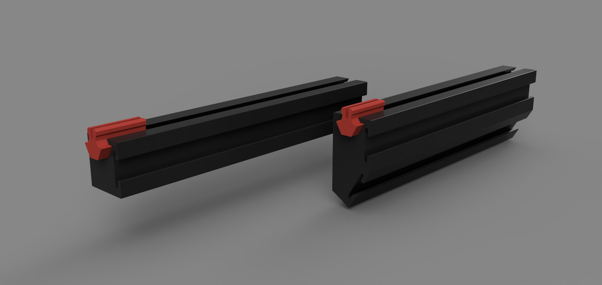
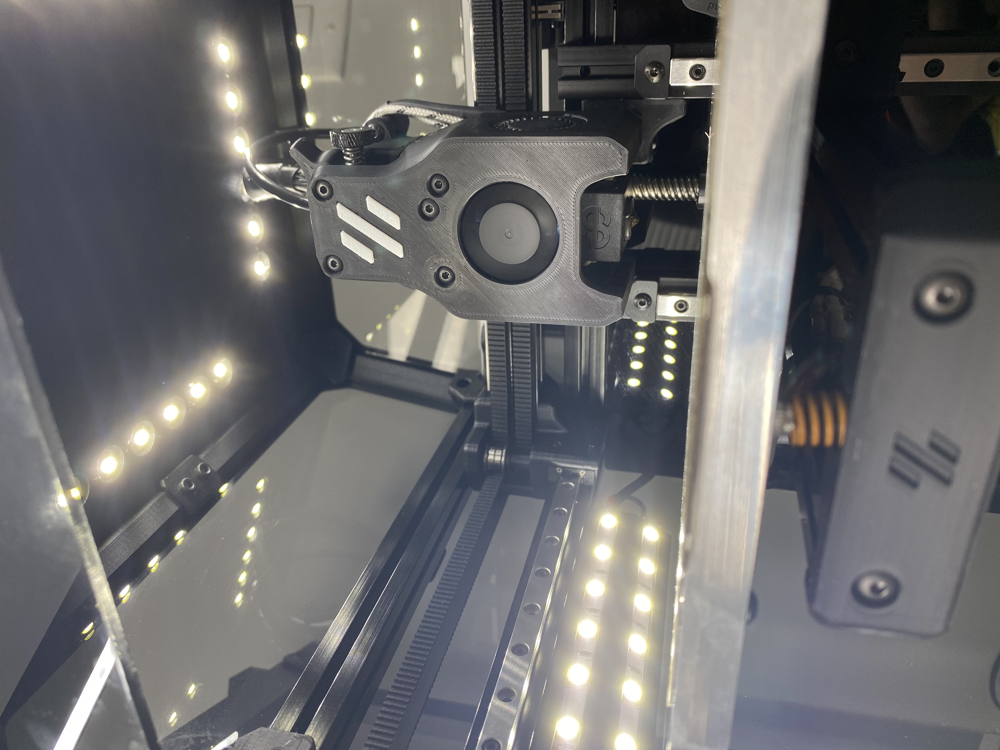

# V0 LED Lightbar



## Printed Parts:
1. 9030-LED-Bar OR 90-LED-Bar
2. 1515-Snap

Note: Designed around lightstrip linked below. I would suggest printing a test part first to check for fitment of your LED strip & 1515 snap clearance. Snap has a clearance of 0.1mm.

Note: The 9030 .STL has two tracks for LEDs -- 90 degrees and 30 degrees allowing for lighting for first layer and midprint. 90 .STL is only the 90 degree single track

Note: Only 1x 1515-Snap .STL is required. Additional may make the part challenging to remove.

## Parts:
1. 24V LED Lightstrip \\\ URL: https://tinyurl.com/7axzaff4
2. 22 AWG Wire

## Printer Config:
```
[output_pin caselight]
pin: PC9
pwm:true
shutdown_value: 0
value: 1.0
cycle_time: 0.01

[gcode_macro LEDOFF]
gcode:  SET_PIN PIN=caselight VALUE=0

[gcode_macro LEDMIN]
gcode:  SET_PIN PIN=caselight VALUE=.25

[gcode_macro LEDMAX]
gcode:  SET_PIN PIN=caselight VALUE=1
```



#### Note -- I am using AC Bed with SSR. SSR output on PC12 (PWR-DET) and LED Lights are running off PC9 (BED)

LED Tophat Mod: https://github.com/VoronDesign/VoronUsers/tree/master/printer_mods/Shteeeeeve/V01-LED-Tophat